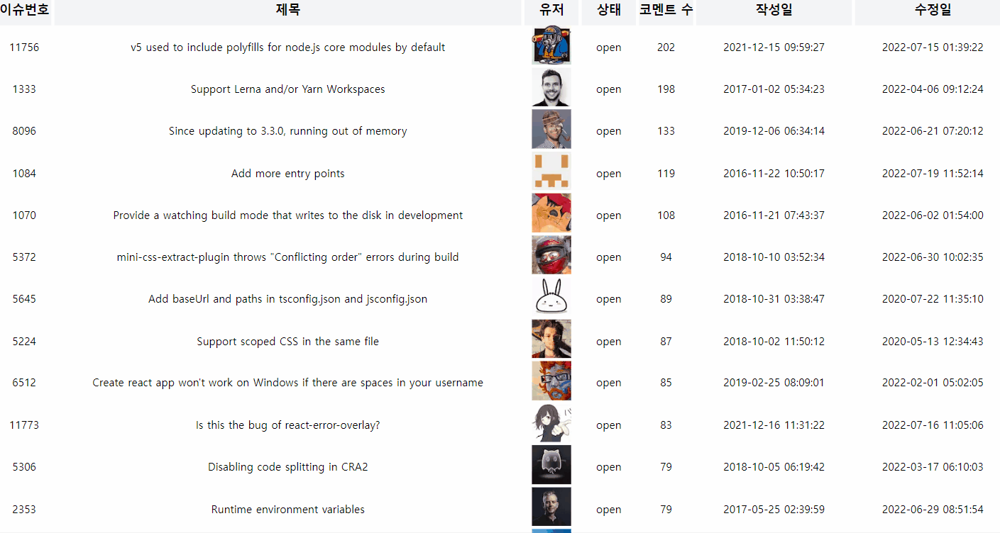

### 1. 설치 및 실행

```js
yarn
yarn dev
```

### 2. 사용 기술

- `next.js`
- `typescript`
- `tailwindcss`
- `emotioncss`
- `react-query`
- `axios`

### 3. 기능



- css gird를 이용해 목록을 보여줌
- tailwindcss로 css 개발
- react-query로 서버 상태 관리
- typescript로 api 요청 및 응답 타입 정의
- 제목을 누르면 해당 이슈 페이지를 새창으로 띄움
- 유저 프로필을 누르면 해당 유저 상세 페이지를 새창으로 띄움
